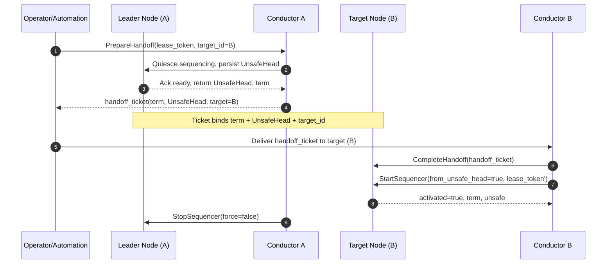
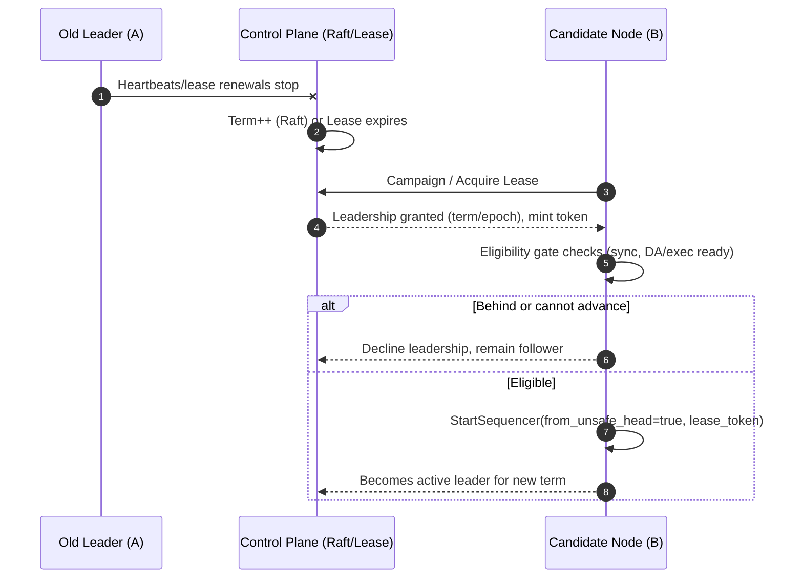
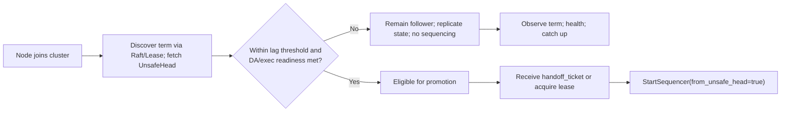

# ADR 023: Sequencer Recovery & Liveness — Rafted Conductor vs 1‑Active/1‑Failover

## Changelog

- 2025-08-21: Initial ADR authored; compared approaches and captured failover and escape‑hatch semantics.

## Context

We need a robust, deterministic way to keep L2 block production live when the primary sequencer becomes unhealthy or unreachable, and to **recover leadership** without split‑brain or unsafe reorgs. The solution must integrate cleanly with `ev-node`, be observable, and support zero‑downtime upgrades. This ADR evaluates two designs for the **control plane** that governs which node is allowed to run the sequencer process.

## Alternative Approaches

Considered but not chosen for this iteration:

- **Many replicas, no coordination**: high risk of **simultaneous leaders** (split‑brain) and soft‑confirmation reversals.
- **Full BFT consensus among sequencers**: heavier operational/engineering cost than needed; our fault model is crash‑fault tolerance with honest operators.
- **Outsource ordering to a shared sequencer network**: viable but introduces an external dependency and different SLOs; out of scope for the immediate milestone.
- **Manual failover only**: too slow and error‑prone for production SLOs.

## Decision

> We will operate **1 active + 1 failover** sequencer at all times, regardless of control plane. Two implementation options are approved:

- **Design A — Rafted Conductor (CFT)**: A sidecar *conductor* runs next to each `ev-node`. Conductors form a **Raft** cluster to elect a single leader and **gate** sequencing so only the Raft leader may produce blocks via the Admin Control API. Applicability: use Raft only when there are **≥ 3 sequencers** (prefer odd N: 3, 5, …). Do not use Raft for two-node 1‑active/1‑failover clusters; use Design B in that case.
  *Note:* OP Stack uses a very similar pattern for its sequencer; see `op-conductor` in References.

- **Design B — 1‑Active / 1‑Failover (Lease/Lock)**: One hot standby promotes itself when the active fails by acquiring a **lease/lock** (e.g., Kubernetes Lease or external KV). Strong **fencing** ensures the old leader cannot keep producing after lease loss.

**Why both assume 1A/1F:** Even with Raft, we intentionally keep **n** nodes on hot standby capable of immediate promotion; additional nodes may exist as **read‑only** or **witness** roles to strengthen quorum without enabling extra leaders.

Status of this decision: **Proposed** for implementation and test hardening.

## Detailed Design

### User requirements
- **No split‑brain**: at most one sequencer is active.
- **Deterministic recovery**: new leader starts from a known **unsafe head**.
- **Fast failover**: p50 ≤ 15s, p95 ≤ 45s.
- **Operational clarity**: health metrics, leader identity, and explicit admin controls.
- **Zero‑downtime upgrades**: blue/green leadership transfer.

### Systems affected
- `ev-node` (sequencer control hooks, health surface).
- New sidecar(s): **conductor** (Design A) or **lease‑manager** (Design B).
- RPC ingress (optional **leader‑aware proxy** to route sequencing endpoints only to the leader).
- CI/CD & SRE runbooks, dashboards, alerts.

### New/changed data structures
- **UnsafeHead** record persisted by control plane: `(block_height, bloch_hash, timestamp)`.
- **Design A (Raft)**: replicated **Raft log** entries for `UnsafeHead`, `LeadershipTerm`, and optional `CommitMeta` (batch/DA pointers); periodic snapshots.
- **Design B (Lease)**: a single **Lease** record (Kubernetes Lease or external KV entry) plus a monotonic **lease token** for fencing.

### Admin Control API (Protobuf)

We introduce a separate, authenticated Admin Control API dedicated to sequencing control. This API is not exposed on the public RPC endpoint and binds to a distinct listener (port/interface, e.g., `:8443` on an internal network or loopback-only in single-host deployments). It is used exclusively by the conductor/lease-manager and by privileged operator automation for break-glass procedures.

Service overview:
- StartSequencer: Arms/starts sequencing subject to fencing (valid lease/term) and optionally pins to last persisted UnsafeHead.
- StopSequencer: Hard stop with optional “force” semantics.
- PrepareHandoff / CompleteHandoff: Explicit, auditable, two-phase, blue/green leadership transfer.
- Health / Status: Health probes and machine-readable node + leader state.

Endpoint separation:
- Public JSON-RPC and P2P endpoints remain unchanged.
- Admin Control API is out-of-band and must not be routed through public ingress. It sits behind mTLS and strict network policy.

The protobuf file is located in `proto/evnode/admin/v1/control.proto`.

Error semantics:
- PERMISSION_DENIED: AuthN/AuthZ failure, missing or invalid mTLS identity.
- FAILED_PRECONDITION: Missing/expired lease or fencing violation; handoff ticket invalid.
- ABORTED: Lost leadership mid-flight; TOCTOU fencing triggered self-stop.
- ALREADY_EXISTS: Start requested but sequencer already active with same term.
- UNAVAILABLE: Local dependencies not ready (DA client, exec engine).

### Efficiency considerations
- **Design A:** Raft heartbeats and snapshotting add small steady‑state overhead; no impact on throughput when healthy.
- **Design B:** Lease renewals are lightweight; performance dominated by `ev-node` itself.

### Expected access patterns
- Reads (RPC, state) should work on all nodes; **writes/sequence endpoints** only on the active leader. If a leader‑aware proxy is deployed, it enforces this automatically.

### Logging/Monitoring/Observability
- Metrics: `leader_id`, `raft_term` (A), `lease_owner` (B), `unsafe_head_advance`, `peer_count`, `rpc_error_rate`, `da_publish_latency`, `backlog`, `leader_election_epoch`, `leader_election_leader_last_seen_ts`, `leader_election_heartbeat_timeout_total`, `leader_election_leader_uptime_ms`.
- Alerts: no unsafe advance > 3× block time; unexpected leader churn; lease lost but sequencer still active (fencing breach).
- Logs: audit all **Start/Stop** decisions and override operations.

## Diagrams

This section illustrates the nominal handoff, crash handover, and node join flows. Diagrams use Mermaid for clarity.

### Planned Leadership Handoff (Prepare → Complete)

Key properties:
- Ticket is audience-bound (target_id) and term-bound; replay-safe.
- New leader must resume from the provided `UnsafeHead` to ensure continuity.
- Old leader performs orderly stop after the new leader activates.

### Crash Handover (Leader loss)

Notes:
- If no candidate passes eligibility, control plane keeps searching or alerts; no split-brain occurs.
- `UnsafeHead` continuity is enforced by token/ticket claims or persisted state.

### Joining Node Flow (Follower by default)

Eligibility gate (No-Advance = No-Leader):
- Must be within configurable lag threshold (height/time) relative to `UnsafeHead` or cluster head.
- DA client reachable and healthy; execution engine synced and ready.
- Local error budget acceptable (no recent critical faults).
- If any check fails, node remains a follower and is not allowed to assume leadership.

### Security considerations
- Lock down **Admin RPC** with mTLS + RBAC; only the sidecar/process account may call Start/Stop.
- Implement **fencing**: leader periodically validates it still holds leadership/lease; otherwise self‑stops.
- Break‑glass overrides must be gated behind separate credentials and produce auditable events.

### Privacy considerations
- None beyond existing node telemetry; no user data added.

### Testing plan
- Kill active sequencer → verify failover within SLO; assert **no double leadership**.
- Partition tests: only Raft majority (A) or lease holder (B) may produce.
- Blue/green: explicit leadership handoff; confirm unsafe head continuity.
- Misconfigured standby → failover should **refuse**; alarms fire.
- Long‑duration outage drills; confirm user‑facing status and catch‑up behavior.

### Change breakdown
- Phase 1: Implement Admin RPC + health surface in `ev-node`; add sidecar skeletons.
- Phase 2: Integrate Design A (Raft) in a 1 sequencer + 2 failover; build dashboards/runbooks.
- Phase 3: Add Design B (Lease) profile for small/test clusters; share common health logic.
- Phase 4: Game days and SLO validation; finalize SRE playbooks.

### Release/compatibility
- **Breaking release?** No — Admin RPCs are additive.

## Status

Proposed

## Consequences

### Positive
- Clear, deterministic leadership with fencing; supports zero‑downtime upgrades.
- Works with `ev-node` via a small, well‑defined Admin RPC.
- Choice of control plane allows right‑sizing ops: Raft for prod; Lease for small/test.

### Negative
- Design A adds Raft operational overhead (quorum management, snapshots).
- Design B has a smaller blast radius but does not generalize to N replicas; stricter reliance on correct fencing.
- Additional components (sidecars, proxies) increase deployment surface.

### Neutral
- Small steady‑state CPU/network overhead for heartbeats/leases; negligible compared to sequencing and DA posting.

## References

- **OP conductor** (industry prior art; similar to Design A):
  - Docs: https://docs.optimism.io/operators/chain-operators/tools/op-conductor
  - README: https://github.com/ethereum-optimism/optimism/blob/develop/op-conductor/README.md

- **`ev-node`** (architecture, sequencing):
  - Repo: https://github.com/evstack/ev-node
  - Quick start: https://ev.xyz/guides/quick-start
  - Discussions/issues on sequencing API & multi-sequencer behavior.

- **Lease-based leader election**:
  - Kubernetes Lease API: https://kubernetes.io/docs/concepts/architecture/leases/
  - client-go leader election helpers: https://pkg.go.dev/k8s.io/client-go/tools/leaderelection
