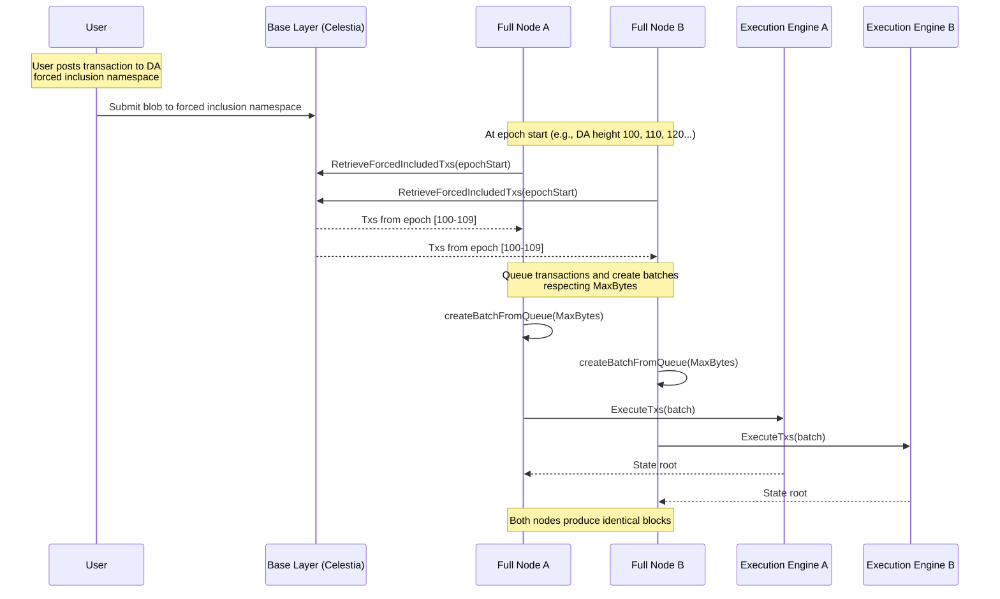

# ADR 012: Based Sequencing

## Changelog

- 2025-04-09: Initial draft
- 2025-04-09: Added optional UX optimization where full nodes can relay user transactions to base layer
- 2025-04-09: Added rationale for VerifyBatch utility in a based setup
- 2025-04-10: Added Relaying Costs and Fee Compensation via EVM
- 2025-11-27: Updated to reflect actual implementation with epoch-based forced inclusion

## Context

Most chains today rely on single sequencers to form batches of user transactions, despite the availability of base layers (like Celestia) that provide data availability and canonical ordering guarantees. A single sequencer introduces liveness and censorship risks, as well as complexity in proposer election, fault tolerance, and bridge security.

Based sequencing eliminates this reliance by having the base layer determine transaction ordering. This ADR describes the **epoch-based forced inclusion** implementation where **every full node acts as its own proposer** by independently:

- Reading forced inclusion transactions from the base layer at epoch boundaries
- Applying deterministic batching rules
- Executing transactions to compute state updates

This approach ensures consistency, removes the need for trusted intermediaries, and improves decentralization and resilience.

## Alternative Approaches

### Single Sequencer

- A designated sequencer collects transactions and publishes them to the base layer.
- Simpler for UX and latency control, but introduces centralization and failure points.

### Leader-Elected Proposer (e.g., BFT committee or rotating proposer)

- Some nodes are elected to act as proposers for efficiency.
- Still introduces trust assumptions, coordination complexity, and MEV-related risks.

### Continuous DA Polling

- Full nodes continuously poll DA and form batches based on size thresholds.
- More complex coordination and can lead to inconsistent batch boundaries across nodes.

The epoch-based approach provides deterministic batch boundaries while minimizing DA queries and ensuring all honest nodes derive identical blocks.

## Decision

We adopt a based sequencing model where every full node in the network acts as its own proposer using an epoch-based forced inclusion mechanism:

### Core Principles

1. **Epoch Boundaries**: Transactions are retrieved from DA in epochs defined by `DAEpochForcedInclusion`
2. **Deterministic Batch Formation**: All nodes apply the same rules to form batches from queued transactions
3. **MaxBytes Enforcement**: Individual blocks respect a maximum byte limit (2MB default)
4. **Transaction Smoothing**: Large transaction sets can be smoothed across multiple blocks within an epoch
5. **No Trusted Sequencer**: All ordering comes from the base layer

### Sequencing Model

The `BasedSequencer` implementation:

- **Only retrieves transactions from DA** via forced inclusion namespace
- **Ignores transactions submitted via `SubmitBatchTxs`** (no mempool)
- **Fetches at epoch boundaries** to minimize DA queries
- **Queues transactions** and creates batches respecting `MaxBytes`
- **Validates blob sizes** against absolute maximum to prevent oversized submissions

### Transaction Flow



## Detailed Design

### Epoch-Based Retrieval

**Epoch Calculation**:

- Epoch number: `((daHeight - daStartHeight) / daEpochSize) + 1`
- Epoch boundaries: `[start, end]` where transactions must be included

**Example with `DAEpochForcedInclusion = 10`**:

- DA heights 100-109 = Epoch 1
- DA heights 110-119 = Epoch 2
- DA heights 120-129 = Epoch 3

**Retrieval Logic** (`ForcedInclusionRetriever`):

1. Check if DA height is at epoch start
2. If not at epoch start, return empty transaction set
3. If at epoch start, fetch all blobs from forced inclusion namespace for entire epoch
4. Return `ForcedInclusionEvent` with transactions and DA height range

### Batch Formation

**BasedSequencer Queue Management**:

```go
// On GetNextBatch:
1. Retrieve forced inclusion transactions for current epoch
2. Validate blob sizes (skip oversized blobs)
3. Add valid transactions to internal queue
4. Create batch from queue respecting MaxBytes
5. Return batch (may be partial if queue exceeds MaxBytes)
```

**Batch Creation** (`createBatchFromQueue`):

- Iterate through queued transactions
- Accumulate until `totalBytes + txSize > MaxBytes`
- Stop at limit and preserve remaining transactions for next block
- Clear queue when all transactions consumed

### Block Production

**Executor Flow** (`block/internal/executing/executor.go`):

1. **Retrieve Batch**: Call `sequencer.GetNextBatch(MaxBytes: 2MB)`
2. **Handle Empty Batch**: Skip block production if no transactions
3. **Create Block**: Form block header and data with batch transactions
4. **Execute**: Apply transactions via execution engine
5. **Update State**: Store DA height from sequencer in state
6. **Sign Header**: Based sequencer returns empty signature
7. **Persist**: Save block to store
8. **Broadcast**: Propagate header and data to P2P network

### Transaction Smoothing

When forced inclusion transactions exceed `MaxBytes`:

**Block 1**:

```
Epoch [100-109] contains 3MB of transactions
Block at DA height 100: 2MB (partial)
Remaining in queue: 1MB
```

**Block 2**:

```
Block at DA height 101: 1MB (remainder) + new regular txs
Queue cleared
```

This ensures all epoch transactions are eventually included while respecting block size limits.

### Forced Inclusion Verification

Full nodes verify that batches include all required forced inclusion transactions via `Syncer.verifyForcedInclusionTxs`:

1. Retrieve forced inclusion transactions for current DA height
2. Check all forced txs are present in block
3. Allow deferral within epoch boundaries
4. Reject blocks that:
   - Censor forced inclusion transactions after epoch end
   - Skip forced transactions without valid reason

### Data Structures

**ForcedInclusionEvent**:

```go
type ForcedInclusionEvent struct {
    StartDaHeight uint64    // Epoch start DA height
    EndDaHeight   uint64    // Last processed DA height in epoch
    Txs           [][]byte  // All transactions from epoch
}
```

**BasedSequencer State**:

```go
type BasedSequencer struct {
    daHeight    atomic.Uint64  // Current DA height
    txQueue     [][]byte       // Queued transactions awaiting inclusion
}
```

### Configuration

**Genesis Configuration**:

- `DAStartHeight`: Starting DA height for the chain
- `DAEpochForcedInclusion`: Number of DA blocks per epoch (e.g., 10)

**Constants**:

- `DefaultMaxBlobSize`: 2MB per batch/block
- Enforced both at submission and retrieval

### Systems Affected

- **BasedSequencer**: Implements epoch-based transaction retrieval
- **ForcedInclusionRetriever**: Fetches transactions from DA at epochs
- **Executor**: Drives block production using sequencer batches
- **Syncer**: Verifies forced inclusion compliance
- **DA Client**: Must support forced inclusion namespace

### APIs

**Sequencer Interface**:

```go
// Returns empty response - based sequencer ignores submissions
SubmitBatchTxs(ctx, req) (*SubmitBatchTxsResponse, error)

// Retrieves next batch from forced inclusion queue
GetNextBatch(ctx, req) (*GetNextBatchResponse, error)

// Always returns true for based sequencer
VerifyBatch(ctx, req) (*VerifyBatchResponse, error)
```

**Forced Inclusion Retrieval**:

```go
// Retrieves forced inclusion txs at DA height (epoch start)
RetrieveForcedIncludedTxs(ctx, daHeight) (*ForcedInclusionEvent, error)
```

### Block Time Characteristics

- **Block time is a function of DA layer block time**
- With `DAEpochForcedInclusion = 10` and Celestia ~12s block time:
  - Minimum block time: ~12s (if transactions present)
  - Maximum epoch duration: ~120s (10 blocks)
- **Lazy mode has no effect** - based sequencing inherently follows DA timing
- **No headers are published to DA** - only forced inclusion blobs

### Security Considerations

**Trust Model**:

- No trusted sequencer required
- All nodes derive identical state from DA
- Invalid blocks are automatically rejected by execution rules

**Attack Vectors**:

- Invalid State: Rejected by execution engine during `ExecuteTxs`
- Blob Spam: Limited by DA namespace fees and size validation
- Incorrect Batch: Each node independently derives batches, inconsistent nodes fall out of sync

### Efficiency

- Minimal DA Queries: Only fetch at epoch boundaries
- Bounded Latency: Epoch duration provides upper bound
- Transaction Queuing: Smooth large batches across multiple blocks

## Status

Implemented

## Consequences

### Positive

- **Eliminates single sequencer dependency** - fully decentralized ordering
- **Deterministic consensus** - all nodes converge on same state
- **Censorship resistance** - forced inclusion verified by all nodes
- **Simplified architecture** - no proposer election or coordination
- **Economic sustainability** - fee recipient mechanism enables relay compensation

### Negative

- **Block time tied to DA layer** - cannot be independently configured
- **Minimum latency** - at least one DA block time
- **Epoch-based batching** - cannot include transactions mid-epoch

### Neutral

- **No mempool in based sequencer** - transactions only via forced inclusion
- **Queue management required** - full nodes maintain transaction queues
- **DA namespace dependency** - requires forced inclusion namespace support

## Future Enhancements

1. **Transaction Relaying**: Implement full node RPC endpoints to accept and relay user transactions to DA
2. **Dynamic Epochs**: Adjust epoch size based on transaction volume or network conditions
3. **Priority Mechanisms**: Support application-specific transaction ordering within epochs
4. **Light Client Integration**: Implement header verification without full re-execution
5. **Cross-Chain Inclusion**: Enable forced inclusion from multiple DA layers

## References

<!-- markdown-link-check-disable -->

- [EthResearch: Based Rollups](https://ethresear.ch/t/based-rollups-superpowers-from-l1-sequencing/15016)
- [Taiko: Based Sequencing](https://taiko.mirror.xyz/7dfMydX1FqEx9_sOvhRt3V8hJksKSIWjzhCVu7FyMZU)
- [Surge Rollup](https://www.surge.wtf/)
- [Spire](https://www.spire.dev/)
- [Puffer UniFi](https://www.puffer.fi/unifi)
