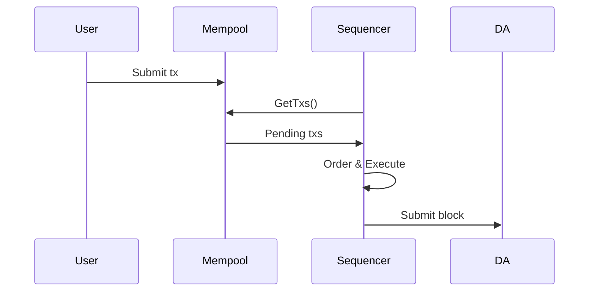

# Sequencing

Sequencing determines transaction ordering. The sequencer collects transactions, orders them, and produces blocks.

## Sequencer Interface

The [Sequencer interface](https://github.com/evstack/ev-node/blob/main/core/sequencer/sequencing.go) defines how ev-node communicates with sequencing implementations:

```go
type Sequencer interface {
    // Submit transactions to the sequencer
    SubmitBatchTxs(ctx context.Context, req SubmitBatchTxsRequest) (*SubmitBatchTxsResponse, error)

    // Get the next batch of ordered transactions
    GetNextBatch(ctx context.Context, req GetNextBatchRequest) (*GetNextBatchResponse, error)

    // Verify a batch from another source
    VerifyBatch(ctx context.Context, req VerifyBatchRequest) (*VerifyBatchResponse, error)
}
```

## Sequencing Modes

### Single Sequencer

One node orders transactions and produces blocks.

```
User → Mempool → Sequencer → Block → DA
```

**Characteristics:**
- Fast block times (~100ms possible)
- Simple operation
- Single point of ordering (with forced inclusion for censorship resistance)

**Configuration:**
```yaml
node:
  aggregator: true
  block-time: 100ms
```

See [Single Sequencer / Forced Inclusion](/guides/advanced/forced-inclusion) for details.

### Based Sequencer

Transaction ordering is determined by the DA layer. Every full node derives blocks independently.

```
User → DA Layer → All Nodes Derive Same Blocks
```

**Characteristics:**
- No single sequencer
- Ordering from DA layer (slower blocks)
- Maximum censorship resistance

**Configuration:**
```yaml
node:
  aggregator: true
  based-sequencer: true
```

See [Based Sequencing](/guides/advanced/based-sequencing) for details.

## Choosing a Sequencing Mode

| Factor | Single Sequencer | Based Sequencer |
|--------|-----------------|-----------------|
| Block time | ~100ms | ~12s (DA block time) |
| Censorship resistance | Forced inclusion | Native |
| Complexity | Lower | Higher |
| MEV | Sequencer controls | DA layer controls |

## Forced Inclusion

Single sequencer mode includes forced inclusion for censorship resistance:

1. Users can submit transactions directly to DA
2. Sequencer must include these within a grace period
3. Failure to include marks sequencer as malicious
4. Chain can transition to based mode

This provides a safety mechanism while maintaining fast block times.

## Transaction Flow



## Learn More

- [Single Sequencer / Forced Inclusion](/guides/advanced/forced-inclusion)
- [Based Sequencing](/guides/advanced/based-sequencing)
- [Sequencer Interface Reference](/reference/interfaces/sequencer)
