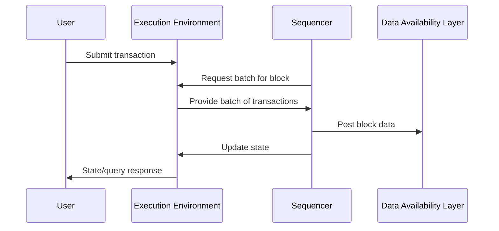

# Forced Inclusion

Forced inclusion is a censorship-resistance mechanism that allows users to submit transactions directly to the DA layer when the sequencer refuses to include them. This ensures users always have an escape hatch in a single sequencer model.

## How the Single Sequencer Model Works

1. **Transaction Submission:**
   - Users submit transactions to the execution environment via RPC or other interfaces.
2. **Transaction Collection and Ordering:**
   - The execution environment collects incoming transactions.
   - The sequencer requests a batch of transactions from the execution environment to be included in the next block.
3. **Block Production:**
   - **Without lazy mode:** the sequencer produces new blocks at fixed intervals.
   - **With lazy mode:** the sequencer produces a block once either
     - enough transactions are collected
     - the lazy-mode block interval elapses
       More info in the [lazy mode configuration guide](../config.md#lazy-mode-lazy-aggregator).
   - Each block contains a batch of ordered transactions and metadata.

4. **Data Availability Posting:**
   - The sequencer posts the block data to the configured DA layer (e.g., Celestia).
   - This ensures that anyone can access the data needed to reconstruct the chain state.

5. **State Update:**
   - The sequencer updates the chain state based on the new block and makes the updated state available to light clients and full nodes.

## Transaction Flow Diagram



## Forced Inclusion

While the single sequencer controls transaction ordering, the system provides a censorship-resistance mechanism called **forced inclusion**. This ensures users can always include their transactions even if the sequencer refuses to process them.

### How Forced Inclusion Works

1. **Direct DA Submission:**
   - Users can submit transactions directly to the DA layer's forced inclusion namespace
   - These transactions bypass the sequencer entirely

2. **Epoch-Based Retrieval:**
   - The sequencer retrieves forced inclusion transactions from the DA layer at epoch boundaries
   - Epochs are defined by `DAEpochForcedInclusion` in the genesis configuration

3. **Mandatory Inclusion:**
   - The sequencer MUST include all forced inclusion transactions from an epoch before the epoch ends
   - Full nodes verify that forced inclusion transactions are properly included

4. **Smoothing:**
   - If forced inclusion transactions exceed block size limits (`MaxBytes`), they can be spread across multiple blocks within the same epoch
   - All transactions must be included before moving to the next epoch

### Example

```text
Epoch [100, 109] (epoch size = 10):
  - User submits tx directly to DA at height 102
  - Sequencer retrieves forced txs at epoch start (height 100)
  - Sequencer includes forced tx in blocks before height 110
```

See [Based Sequencing](./based-sequencing.md) for a fully decentralized alternative that relies entirely on forced inclusion.

## Detecting Malicious Sequencer Behavior

Full nodes continuously monitor the sequencer to ensure it follows consensus rules, particularly around forced inclusion:

### Censorship Detection

If a sequencer fails to include forced inclusion transactions past their epoch boundary, full nodes will:

1. **Detect the violation** - missing transactions from past epochs
2. **Reject invalid blocks** - do not build on top of censoring blocks
3. **Log the violation** with transaction hashes and epoch details
4. **Halt consensus** - the chain cannot progress with a malicious sequencer

### Recovery from Malicious Sequencer

When a malicious sequencer is detected (censoring forced inclusion transactions):

Nodes may require a coordinated restart into based sequencing mode, depending on governance and operator policy.

```bash
# One possible coordinated recovery action
./evnode start --evnode.node.aggregator --evnode.node.based_sequencer
```

**In based sequencing mode:**

- No single sequencer controls transaction ordering
- Every full node derives blocks independently from the DA layer
- Forced inclusion becomes the primary (and only) transaction submission method
- Censorship becomes impossible as ordering comes from the DA layer

**Important considerations:**

- Operators should agree on the last valid state and restart timing before the cutover.
- All full nodes should coordinate the switch to based mode
- The chain continues from the last valid state
- Users submit transactions directly to the DA layer going forward
- Returning to single sequencer mode requires explicit governance and operational coordination

See [Based Sequencing documentation](./based-sequencing.md) for details on operating in this mode.

## Advantages

- **Simplicity:** Easy to set up and operate, making it ideal for development, testing, and small-scale deployments compared to other more complex sequencers.
- **Low Latency:** Fast block production and transaction inclusion, since there is no consensus overhead among multiple sequencers.
- **Independence from DA block time:** The sequencer can produce blocks on its own schedule, without being tied to the block time of the DA layer, enabling more flexible transaction processing than DA-timed sequencers.
- **Forced inclusion fallback:** Users can always submit transactions via the DA layer if the sequencer is unresponsive or censoring.

## Disadvantages

- **Single point of failure:** If the sequencer goes offline, block production stops (though the chain can transition to based mode).
- **Trust requirement:** Users must trust the sequencer to include their transactions in a timely manner (mitigated by forced inclusion).
- **Censorship risk:** A malicious sequencer can temporarily censor transactions until forced inclusion activates or the chain transitions to based mode.
