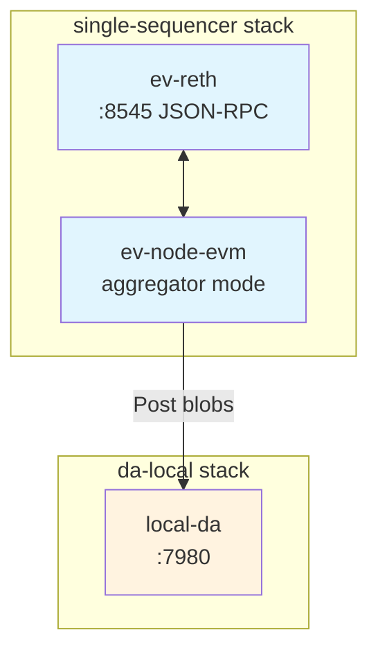

# 🏠 Local Development Deployment

This guide walks you through deploying a complete Evolve EVM chain on your local machine using [ev-toolbox](https://github.com/evstack/ev-toolbox). It uses the **local-da** mock DA layer so there are no external dependencies or token costs.

## 🏗️ How it works

The local stack is split into two Docker Compose stacks that share a Docker network (`evstack_shared`):



The `da-local` stack is started first because it creates the shared Docker network that the sequencer stack joins.

## 💻 Prerequisites {#prerequisites}

- [Docker](https://docs.docker.com/get-docker/) 20.10 or later
- [Docker Compose](https://docs.docker.com/compose/install/) v2 or later
- [Git](https://git-scm.com/)

## 🛠️ Step 1 — Clone ev-toolbox {#clone}

```bash
git clone --depth 1 https://github.com/evstack/ev-toolbox.git
cd ev-toolbox/ev-stacks/stacks
```

## 🌐 Step 2 — Start local-da {#start-local-da}

The `da-local` stack must be started first. It creates the `evstack_shared` Docker network that the sequencer stack joins.

```bash
cd da-local
docker compose up -d
```

Verify it is running:

```bash
docker logs local-da
```

Expected output:

```text
INF NewLocalDA: initialized LocalDA component=da
INF Listening on component=da host=0.0.0.0 maxBlobSize=1970176 port=7980
INF server started component=da listening_on=0.0.0.0:7980
```

## 🔑 Step 3 — Create the passphrase file {#passphrase}

The sequencer signs blocks with a key protected by a passphrase. Create the passphrase file in the single-sequencer directory:

```bash
cd ../single-sequencer
echo -n "devpassword" > passphrase
```

:::tip
For local development, any string works as a passphrase. Keep it simple — you will not need it again unless you restart with a wiped volume.
:::

## 🚀 Step 4 — Start the sequencer {#start-sequencer}

Make the entrypoint script executable (required after `git clone` on some systems), then start the stack using the local-DA variant of the compose file:

```bash
chmod +x entrypoint.sequencer.sh
docker compose -f docker-compose.da.local.yml up -d
```

Monitor startup:

```bash
docker compose -f docker-compose.da.local.yml logs -f
```

A healthy startup looks like:

```text
single-sequencer  | 🚀 INIT: Starting EVM Sequencer initialization
single-sequencer  | ✅ SUCCESS: Sequencer initialization completed
single-sequencer  | ✅ SUCCESS: Exported genesis.json to /volumes/sequencer_export/genesis.json
single-sequencer  | ✅ SUCCESS: Successfully retrieved genesis hash: 0x6aec2...
single-sequencer  | 🚀 INIT: Starting EVM sequencer with command: evm start ...
single-sequencer  | INF Starting aggregator node component=main
single-sequencer  | INF produced block component=executor height=1
single-sequencer  | INF produced block component=executor height=2
```

:::info DA submission errors
You may see errors like `DA layer submission failed: method 'blob.Submit' not found`. This is a known version mismatch between the current local-da Docker images and ev-node-evm. It is **non-fatal** — blocks are produced and the JSON-RPC is fully functional for local development. You can ignore these errors.
:::

## ✅ Step 5 — Verify {#verify}

The sequencer JSON-RPC port (`8545`) is not exposed to the host by default. To expose it for local testing, create an override file:

```bash
cat > docker-compose.override.yml << 'EOF'
services:
  ev-reth-sequencer:
    ports:
      - "8545:8545"
EOF

docker compose -f docker-compose.da.local.yml -f docker-compose.override.yml up -d
```

Then query the chain:

```bash
curl -s -X POST http://localhost:8545 \
  -H 'Content-Type: application/json' \
  -d '{"jsonrpc":"2.0","method":"eth_blockNumber","params":[],"id":1}'
```

The `result` field (a hex block number) should increment with each call as new blocks are produced.

## 🔍 Useful commands {#commands}

```bash
# Check container status
docker ps

# Follow all sequencer logs
docker compose -f docker-compose.da.local.yml logs -f

# Follow just the ev-node logs (block production)
docker logs -f single-sequencer

# Follow just the reth logs
docker logs -f ev-reth-sequencer

# Stop everything
docker compose -f docker-compose.da.local.yml down
cd ../da-local && docker compose down
```

## ⚙️ Configuration {#configuration}

All configuration is via environment variables in `.env` and the `docker-compose.da.local.yml` file.

| Variable                            | Default | Description                                              |
| ----------------------------------- | ------- | -------------------------------------------------------- |
| `SEQUENCER_EV_RETH_PROMETHEUS_PORT` | `9000`  | Host port for ev-reth Prometheus metrics                 |
| `SEQUENCER_EV_NODE_PROMETHEUS_PORT` | `26660` | Host port for ev-node Prometheus metrics                 |
| `DA_SIGNING_ADDRESSES`              | (empty) | DA signing addresses — leave empty for local-da          |
| `EVM_BLOCK_TIME`                    | `500ms` | How often the sequencer produces blocks (set in compose) |

To change the block time or other settings, edit `docker-compose.da.local.yml` directly or add them to your `docker-compose.override.yml`.

## 🎉 Next Steps {#next-steps}

Once your local chain is running:

- [Testnet Deployment](./testnet.md) — deploy with real Celestia DA and a multi-node setup
- [Local DA Guide](../da/local-da.md) — more about the `local-da` mock DA node
- [Metrics](../metrics.md) — add Prometheus + Grafana monitoring

:::warning
This setup is for development only. The `local-da` mock does not provide real data availability guarantees. Do not use it for any production environment.
:::
