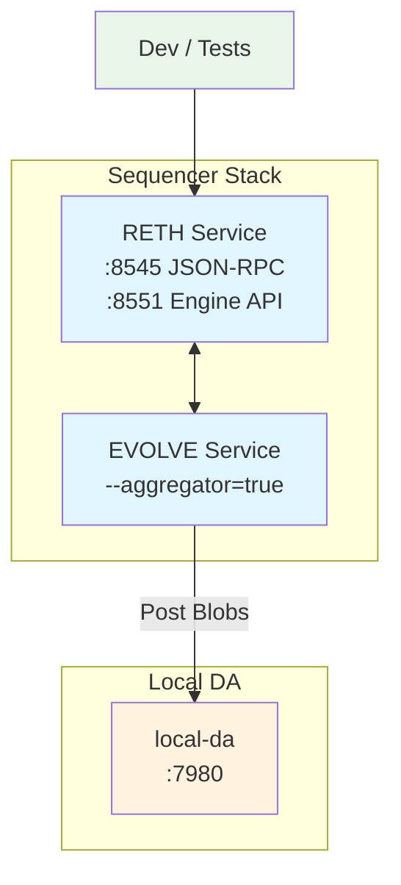

# 🏠 Local Development Deployment

This guide walks you through deploying a complete Evolve EVM chain on your local machine for development and testing. Unlike testnet and mainnet deployments, local dev uses the **local-da** mock DA layer so you have zero external dependencies.

<!-- markdownlint-disable MD033 -->
<script setup>
import constants from '../../.vitepress/constants/constants.js'
</script>
<!-- markdownlint-enable MD033 -->

## 🏗️ Architecture Overview

A local Evolve EVM deployment consists of three services running on your machine:



**Key differences from testnet/mainnet:**

- `local-da` replaces Celestia — no tokens, no external network
- Single sequencer only — no full nodes required
- All services run on `localhost`

## 💻 Prerequisites {#prerequisites}

- [Go](https://golang.org/doc/install) {{ constants.golangVersion }} or later
- [Docker](https://docs.docker.com/get-docker/) and [Docker Compose](https://docs.docker.com/compose/install/)
- [just](https://github.com/casey/just#installation) (command runner)
- [Git](https://git-scm.com/)

## 🛠️ Step 1 — Clone and Build {#clone-and-build}

```bash
git clone --depth 1 --branch {{ constants.evolveLatestTag }} https://github.com/evstack/ev-node.git
cd ev-node

# Build the EVM sequencer binary and local-da
just build-evm
just build-da
```

After building you will have:

- `build/evm` — the Evolve EVM sequencer
- `build/local-da` — the mock DA node

## 🌐 Step 2 — Start local-da {#start-local-da}

Open a terminal and start the local DA node:

```bash
./build/local-da
```

You should see:

```
INF NewLocalDA: initialized LocalDA component=da
INF Listening on component=da host=localhost maxBlobSize=1974272 port=7980
INF server started component=da listening_on=localhost:7980
```

Leave this running in its own terminal tab.

## ⚡ Step 3 — Start the EVM (RETH) Layer {#start-evm-layer}

Clone the `ev-reth` repository and start RETH using Docker Compose:

```bash
git clone --depth 1 https://github.com/evstack/ev-reth.git
cd ev-reth
docker compose up -d
```

Note the path to the JWT secret — you will need it in the next step:

```bash
# Default location after docker compose starts
ls ev-reth/execution/evm/docker/jwttoken/jwt.hex
```

## 🚀 Step 4 — Initialize and Start the Sequencer {#start-sequencer}

Back in the `ev-node` directory, initialize the sequencer:

```bash
./build/evm init \
  --evnode.node.aggregator=true \
  --evnode.signer.passphrase secret
```

Then start it, pointing at local-da and the JWT secret from RETH:

```bash
./build/evm start \
  --evnode.node.aggregator=true \
  --evnode.signer.passphrase secret \
  --evnode.da.address http://localhost:7980 \
  --evnode.node.block_time 1s \
  --evm.jwt-secret /path/to/ev-reth/execution/evm/docker/jwttoken/jwt.hex
```

Replace `/path/to/ev-reth/` with the actual path to your cloned `ev-reth` directory.

You should see block production logs like:

```
INF working in aggregator mode block_time=1000 component=main
INF using pending block component=BlockManager height=1
INF block marked as DA included blockHash=... blockHeight=1 module=BlockManager
```

## ✅ Step 5 — Verify {#verify}

Query the JSON-RPC endpoint to confirm the chain is producing blocks:

```bash
curl -s -X POST http://localhost:8545 \
  -H 'Content-Type: application/json' \
  -d '{"jsonrpc":"2.0","method":"eth_blockNumber","params":[],"id":1}'
```

The `result` field should increment with each call as new blocks are produced.

## 🐳 Alternative: Docker Compose (all-in-one) {#docker-compose}

The [ev-toolbox](https://github.com/evstack/ev-toolbox/tree/main/ev-stacks) project provides a pre-configured Docker Compose stack that wires up RETH, the Evolve EVM sequencer, and local-da for you:

```bash
git clone https://github.com/evstack/ev-toolbox.git
cd ev-toolbox/ev-stacks/local
docker compose up
```

This is the fastest way to get a fully functional local environment without manually coordinating services.

## ⚙️ Configuration Reference {#configuration}

| Flag | Default | Description |
|---|---|---|
| `--evnode.node.aggregator` | `false` | Must be `true` for the sequencer |
| `--evnode.signer.passphrase` | — | Passphrase protecting the signing key |
| `--evnode.da.address` | — | DA node endpoint (`http://localhost:7980` for local-da) |
| `--evnode.node.block_time` | `1s` | How often the sequencer produces blocks |
| `--evm.jwt-secret` | — | Path to the JWT secret shared with RETH |
| `--evm.eth-url` | `http://localhost:8545` | RETH JSON-RPC URL |
| `--evm.engine-url` | `http://localhost:8551` | RETH Engine API URL |

## 🎉 Next Steps {#next-steps}

Once your local chain is running:

- [Testnet Deployment](./testnet.md) — deploy with real Celestia DA and a multi-node setup
- [Single Sequencer Guide](../evm/single.md) — detailed sequencer configuration options
- [Local DA Guide](../da/local-da.md) — more details on the `local-da` mock DA node
- [Metrics](../metrics.md) — add Prometheus + Grafana monitoring

:::warning
This setup is for development only. Do not use `local-da` or a passphrase-protected key in any production environment.
:::
