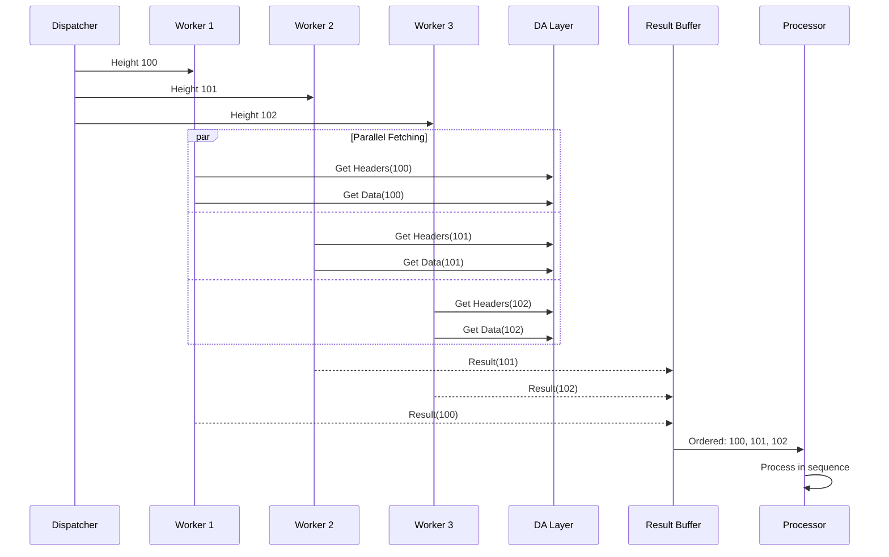

# DA

Evolve provides a generic [data availability interface][da-interface] for modular blockchains. Any DA that implements this interface can be used with Evolve.

## Details

`Client` can connect via JSON-RPC transports using Evolve's [jsonrpc][jsonrpc] implementations. The connection can be configured using the following cli flags:

* `--rollkit.da.address`: url address of the DA service (default: "grpc://localhost:26650")
* `--rollkit.da.auth_token`: authentication token of the DA service
* `--rollkit.da.namespace`: namespace to use when submitting blobs to the DA service (deprecated)
* `--rollkit.da.header_namespace`: namespace to use when submitting headers to the DA service
* `--rollkit.da.data_namespace`: namespace to use when submitting data to the DA service

The block manager now submits headers and data separately to the DA layer using different namespaces:

* **Headers**: Submitted to the namespace specified by `--rollkit.da.header_namespace` (or falls back to `--rollkit.da.namespace` if not set)
* **Data**: Submitted to the namespace specified by `--rollkit.da.data_namespace` (or falls back to `--rollkit.da.namespace` if not set)

Each submission first encodes the headers or data using protobuf (the encoded data are called blobs) and invokes the `Submit` method on the underlying DA implementation with the appropriate namespace. On successful submission (`StatusSuccess`), the DA block height which included the blobs is returned.

To make sure that the serialised blocks don't exceed the underlying DA's blob limits, it fetches the blob size limit by calling `Config` which returns the limit as `uint64` bytes, then includes serialised blocks until the limit is reached. If the limit is reached, it submits the partial set and returns the count of successfully submitted blocks as `SubmittedCount`. The caller should retry with the remaining blocks until all the blocks are submitted. If the first block itself is over the limit, it throws an error.

The `Submit` call may result in an error (`StatusError`) based on the underlying DA implementations on following scenarios:

* the total blobs size exceeds the underlying DA's limits (includes empty blobs)
* the implementation specific failures, e.g., for [celestia-da-json-rpc][jsonrpc], invalid namespace, unable to create the commitment or proof, setting low gas price, etc, could return error.

The retrieval process now supports with both legacy single-namespace mode and separate namespace mode:

### Retrieval Modes

1. **Legacy Mode Support**: For backward compatibility, the system first attempts to retrieve from the legacy namespace if migration has not been completed.

2. **Separate Namespace Retrieval**: The system retrieves headers and data concurrently:
   * Headers are retrieved from the `HeaderNamespace` in parallel with data
   * Data is retrieved from the `DataNamespace` in parallel with headers
   * Each worker processes both namespaces concurrently
   * Results from both namespaces are combined atomically

3. **Namespace Migration**: The system automatically detects and tracks namespace migration:
   * When data is found in new namespaces, migration is marked as complete
   * Migration state is persisted to optimize future retrievals
   * Once migration is complete, legacy namespace checks are skipped
   * Thread-safe migration tracking across parallel workers

If there are no blocks available for a given DA height in any namespace, `StatusNotFound` is returned (which is not an error case). The retrieved blobs are converted back to headers and data, then combined into complete blocks for processing.

### Parallel Retrieval Flow

### Configuration

The parallel retrieval system can be tuned through the following parameters:

* **Worker Count**: Number of concurrent workers (default: 5)
* **Prefetch Window**: Heights to fetch ahead (default: 50)
* **Buffer Size**: Maximum buffered results (default: 200)
* **Retry Strategy**: Exponential backoff with configurable limits

Both header/data submission and retrieval operations may be unsuccessful if the DA node and the DA blockchain that the DA implementation is using have failures. For example, failures such as, DA mempool is full, DA submit transaction is nonce clashing with other transaction from the DA submitter account, DA node is not synced, etc.

## Namespace Separation Benefits

The separation of headers and data into different namespaces provides several advantages:

* **Improved Scalability**: Headers and data can be processed independently, allowing for more efficient resource utilization
* **Flexible Data Availability**: Different availability guarantees can be applied to headers vs data
* **Optimized Retrieval**: Clients can retrieve only the data they need (e.g., light clients may only need headers)
* **Backward Compatibility**: The system maintains support for legacy single-namespace deployments while enabling gradual migration

## References

[1] [da-interface][da-interface]

[2] [jsonrpc][jsonrpc]

[da-interface]: https://github.com/evstack/ev-node/blob/main/core/da/da.go#L11
[jsonrpc]: https://github.com/evstack/ev-node/tree/main/da/jsonrpc
