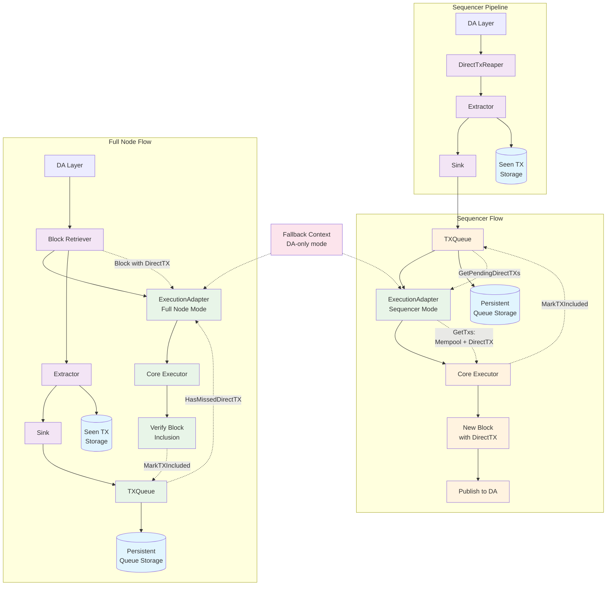

# Direct Transaction Package

The `directtx` package provides functionality for handling direct transactions in the Rollkit framework. Direct transactions are transactions that are submitted directly to the Data Availability (DA) layer and then processed by the rollup sequencer.

## Architecture Overview

The package implements a pipeline for processing direct transactions from the DA layer to execution, with different flows for sequencer and full nodes.

## Core Components

### DirectTX

Core data structure representing a direct transaction with metadata including first seen height and timestamp.

### DirectTxReaper

Periodically polls the DA layer for new blobs, extracts direct transactions, and forwards them for processing.

### Extractor

Processes DA blobs to extract valid direct transactions, handles deduplication using persistent storage, and submits new transactions to the sink.

### Sink

Manages the queue of pending direct transactions with validation, persistence, and inclusion window enforcement.

### TXQueue  

Persistent FIFO queue backed by datastore for durability across restarts.

### ExecutionAdapter

Wraps the core executor to inject direct transactions into the execution pipeline, with support for fallback mode where only DA transactions are processed.

## Data Flow

### Common Pipeline

1. **Reaping**: DirectTxReaper polls DA layer at regular intervals
2. **Extraction**: Raw blobs are parsed and validated by Extractor  
3. **Deduplication**: Seen transactions are filtered out using persistent storage
4. **Queueing**: New transactions are added to persistent TXQueue via Sink

### Sequencer Flow

5. **TX Retrieval**: ExecutionAdapter's `GetTxs()` method calls `GetPendingDirectTXs()` to get direct transactions and combines them with mempool transactions
6. **Block Creation**: Core Executor receives all transactions via `GetTxs()` call
7. **Block Execution**: New block is executed with combined transactions
8. **Cleanup**: `MarkTXIncluded()` removes processed transactions from queue
9. **Publication**: Block is published back to DA layer

### Full Node Flow  

5. **Block Retrieval**: Block Retriever fetches blocks from DA layer containing direct transactions
6. **Block Processing**: ExecutionAdapter receives blocks directly from retriever (not via GetTxs)
7. **Parallel TX Tracking**: Extractor also processes blocks to extract and track direct transactions locally
8. **Deduplication**: Seen transactions are filtered out using local storage  
9. **Local Queueing**: New transactions are added to local TXQueue for verification purposes
10. **Inclusion Verification**: ExecutionAdapter calls `HasMissedDirectTX()` to ensure no transactions were missed
11. **Block Validation**: Core Executor validates the received block with its transactions
12. **Cleanup**: `MarkTXIncluded()` removes processed transactions from local queue

## Key Features

- **Persistence**: Both queue and seen-transaction tracking survive restarts
- **Deduplication**: Prevents processing the same transaction multiple times
- **Fallback Mode**: Context-based switching between normal and DA-only operation
- **Inclusion Windows**: Configurable timing constraints for transaction inclusion
- **Chain Filtering**: Only processes transactions for the correct chain ID
