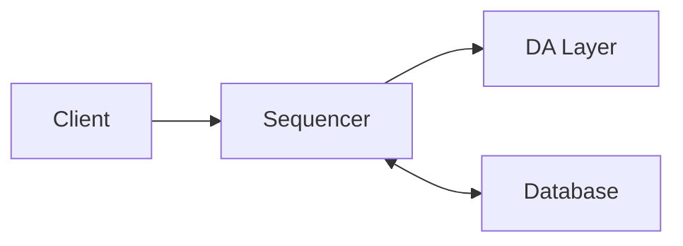
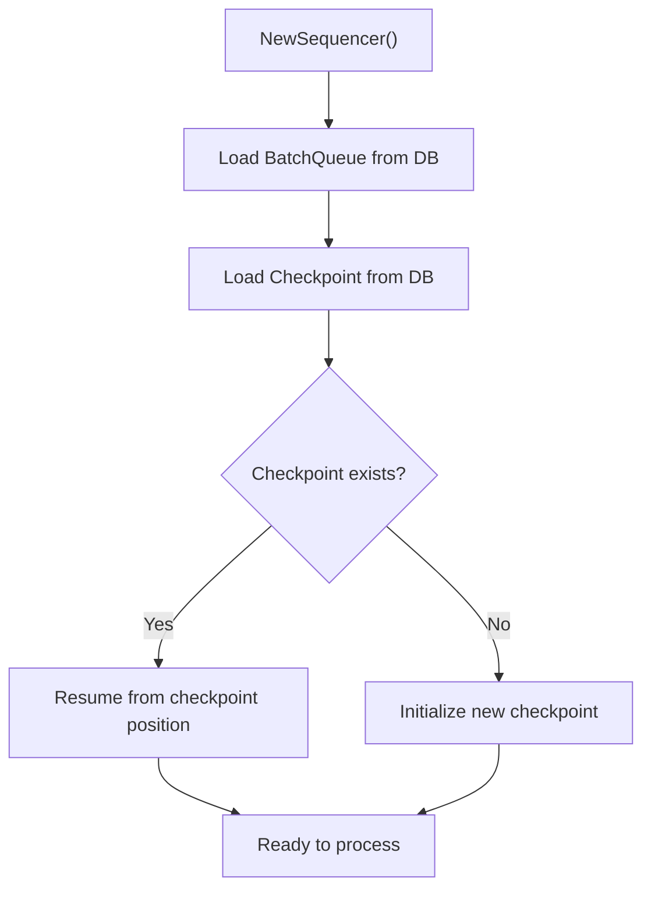
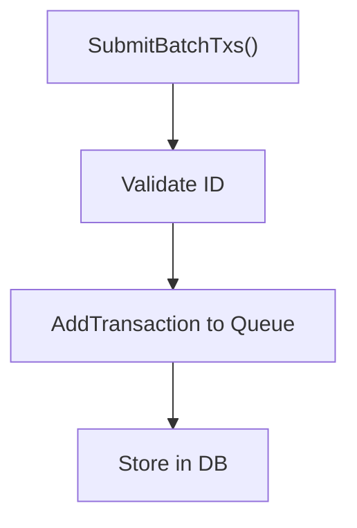
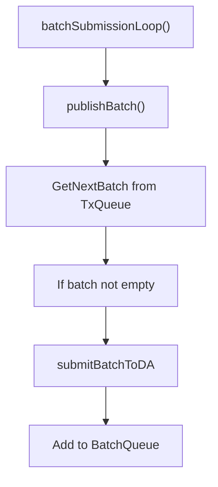
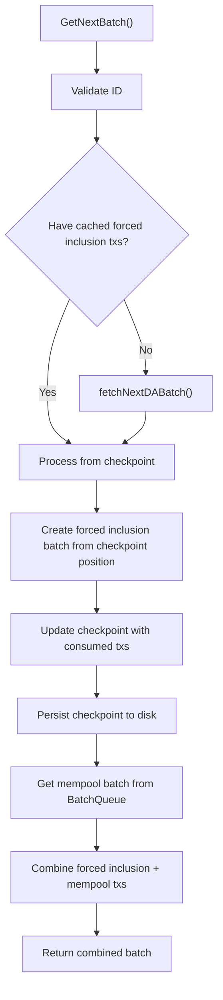
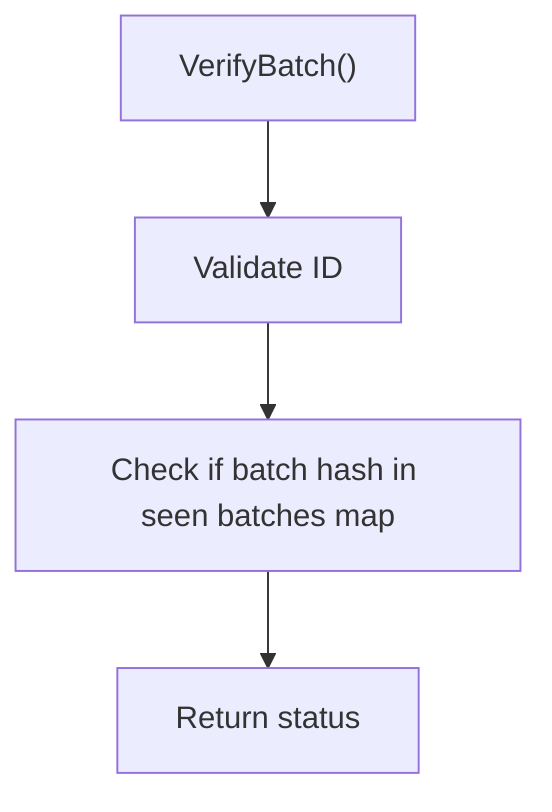

# Single Sequencer

The single sequencer is a component of the Evolve framework that handles transaction ordering and batch submission to a Data Availability (DA) layer. It provides a reliable way to sequence transactions for applications via a designed node called the sequencer.

## Overview

The sequencer receives transactions from clients, batches them together, and submits these batches to a Data Availability layer. It maintains transaction and batch queues, handles recovery from crashes, and provides verification mechanisms for batches.

**Key Feature**: The single sequencer implements a checkpoint system for forced inclusion transactions from DA, ensuring that **DA transactions are never re-executed after a crash**.



## Components

### Sequencer

The main component that orchestrates the entire sequencing process. It:

- Receives transactions from clients (mempool transactions)
- Retrieves forced inclusion transactions from the DA layer
- Maintains transaction and batch queues
- Periodically creates and submits batches to the DA layer
- Handles recovery from crashes via checkpoint system
- Provides verification mechanisms for batches

### BatchQueue

Manages the queue of pending **mempool transactions**:

- Stores batches in memory and in the database
- Provides methods to add and retrieve batches
- Handles recovery of batches from the database after a crash
- Supports queue size limits for backpressure

### CheckpointStore

Manages persistence of the forced inclusion checkpoint:

- Tracks the exact position in the DA transaction stream
- Stores `DAHeight` (current DA block height being processed)
- Stores `TxIndex` (index within the forced inclusion batch)
- Enables crash recovery without re-executing DA transactions
- Persisted after every batch of forced inclusion transactions

### ForcedInclusionRetriever

Retrieves forced inclusion transactions from the DA layer:

- Fetches transactions at epoch boundaries
- Returns all transactions from an entire epoch
- Validates transaction sizes
- Supports epoch-based transaction retrieval

## Flow of Calls

### Initialization Flow



### Transaction Submission Flow



### Batch Creation and Submission Flow



### Batch Retrieval Flow (with Forced Inclusion)



### Batch Verification Flow



## Checkpoint System for Forced Inclusion

### Purpose

The checkpoint system ensures that **forced inclusion transactions from DA are never re-executed after a crash**. This is critical for correctness and determinism.

### How It Works

1. **Checkpoint Structure**:

   ```go
   type Checkpoint struct {
       DAHeight uint64  // Current DA block height being processed
       TxIndex  uint64  // Index within the forced inclusion batch
   }
   ```

2. **Processing Flow**:
   - Fetch forced inclusion transactions from DA at epoch boundaries
   - Cache transactions in memory (`cachedForcedInclusionTxs`)
   - Process transactions incrementally from checkpoint position
   - Update `TxIndex` after each batch
   - When all transactions consumed, increment `DAHeight` and reset `TxIndex`
   - **Persist checkpoint after every batch**

3. **Crash Recovery**:
   - On restart, load checkpoint from disk
   - Re-fetch forced inclusion transactions from DA (entire epoch)
   - Resume processing from `checkpoint.TxIndex`
   - Skip already-processed transactions

### Example

```bash
Initial state: Checkpoint(DAHeight: 100, TxIndex: 0)
DA returns 3 transactions at height 100

Batch 1: Process tx[0]
  → Checkpoint(DAHeight: 100, TxIndex: 1) ✅ Persisted

Batch 2: Process tx[1]
  → Checkpoint(DAHeight: 100, TxIndex: 2) ✅ Persisted

**CRASH OCCURS**

Restart: Load Checkpoint(DAHeight: 100, TxIndex: 2) from disk
  → Re-fetch transactions from DA height 100
  → Resume from tx[2] (skip tx[0] and tx[1])
  → ✅ No re-execution!

Batch 3: Process tx[2]
  → Checkpoint(DAHeight: 101, TxIndex: 0) ✅ Persisted
```

### Comparison with Mempool Transactions

| Aspect            | Forced Inclusion (DA)           | Mempool Transactions   |
| ----------------- | ------------------------------- | ---------------------- |
| Source            | DA layer via forced inclusion   | Client submissions     |
| Persistence       | Checkpoint (DAHeight + TxIndex) | BatchQueue             |
| Crash Recovery    | Resume from checkpoint position | Resume from queue      |
| Re-execution Risk | ❌ Prevented by checkpoint      | ❌ Prevented by queue  |
| Priority          | Always first in batch           | After forced inclusion |

## Database Layout

The single sequencer uses a key-value database to store batches, checkpoints, and metadata. Here's the layout of the database:

### Keys

| Key Pattern          | Description                                |
| -------------------- | ------------------------------------------ |
| `/single/checkpoint` | Checkpoint for forced inclusion processing |
| `batches/<hex_hash>` | Batch data (mempool transactions)          |

### Key Details

#### Checkpoint Key (`/single/checkpoint`)

- Stores the forced inclusion checkpoint
- Used for crash recovery
- Value: Protobuf-encoded checkpoint data (`SequencerDACheckpoint`)
- Updated after every batch of forced inclusion transactions

#### Batch Keys (`batches/<hex_encoded_hash>`)

- Stores mempool transaction batches
- Key is the hex-encoded hash of the batch
- Value: Protobuf-encoded batch data
- Managed by `BatchQueue`

## Recovery Mechanism

The single sequencer implements a robust recovery mechanism to handle crashes:

### For Forced Inclusion Transactions (DA)

1. On startup, load checkpoint from database
2. If no checkpoint exists, initialize with genesis DA height
3. Resume from checkpoint position (`DAHeight` + `TxIndex`)
4. Re-fetch forced inclusion transactions from DA
5. Skip already-processed transactions using `TxIndex`
6. Continue processing from where it left off

**Result**: ✅ No forced inclusion transactions are re-executed

### For Mempool Transactions (Queue)

1. On startup, load all pending batches from database into `BatchQueue`
2. Resume processing batches in order
3. Continue normal operation

**Result**: ✅ No mempool transactions are lost

### Combined Recovery

Both systems work together to ensure:

- **Correctness**: No transaction is lost or re-executed
- **Determinism**: Same state after crash recovery
- **Atomicity**: Checkpoint and queue are consistent

## Metrics

The sequencer exposes the following metrics:

| Metric                  | Description                                      |
| ----------------------- | ------------------------------------------------ |
| `gas_price`             | The gas price of DA                              |
| `last_blob_size`        | The size in bytes of the last DA blob            |
| `transaction_status`    | Count of transaction statuses for DA submissions |
| `num_pending_blocks`    | The number of pending blocks for DA submission   |
| `included_block_height` | The last DA included block height                |

These metrics can be used to monitor the health and performance of the sequencer.

## Usage

To create a new single sequencer:

```go
seq, err := NewSequencer(
    context.Background(),
    logger,
    database,
    daLayer,
    namespace,
    Id,
    batchTime,
    metrics,
)
```

To submit transactions:

```go
response, err := seq.SubmitBatchTxs(
    context.Background(),
    coresequencer.SubmitBatchTxsRequest{
        Id: Id,
        Batch: &coresequencer.Batch{
            Transactions: [][]byte{transaction},
        },
    },
)
```

To get the next batch:

```go
response, err := seq.GetNextBatch(
    context.Background(),
    coresequencer.GetNextBatchRequest{
        Id: Id,
        LastBatchHash: lastHash,
    },
)
```

To verify a batch:

```go
response, err := seq.VerifyBatch(
    context.Background(),
    coresequencer.VerifyBatchRequest{
        Id: Id,
        BatchHash: batchHash,
    },
)
```
