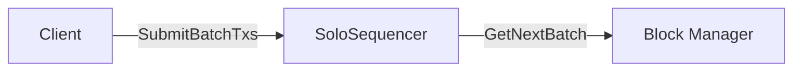
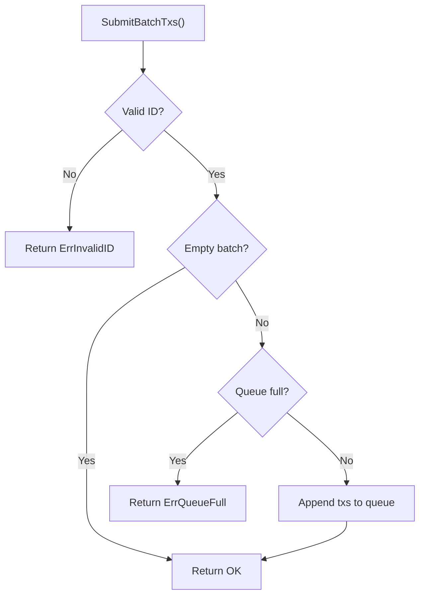
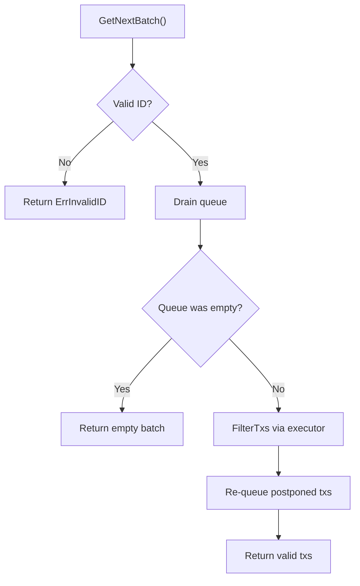

# Solo Sequencer

A minimal single-leader sequencer without forced inclusion support. It accepts mempool transactions via an in-memory queue and produces batches on demand.

## Overview

The solo sequencer is the simplest sequencer implementation. It has no DA-layer interaction for transaction ordering and no crash-recovery persistence. Transactions are held in memory and lost on restart.

Use it when you need a single node that orders transactions without the overhead of forced inclusion checkpoints or DA-based sequencing.



## Design Decisions

| Decision | Rationale |
|---|---|
| In-memory queue | No persistence overhead; suitable for trusted single-operator setups |
| No forced inclusion | Avoids DA epoch tracking, checkpoint storage, and catch-up logic |
| No DA client dependency | `VerifyBatch` returns true unconditionally |
| Configurable queue limit | Provides backpressure when blocks can't be produced fast enough |

## Flow

### SubmitBatchTxs



### GetNextBatch



## Usage

```go
seq := solo.NewSoloSequencer(
    logger,
    cfg,
    []byte("chain-id"),
    1000,              // maxQueueSize (0 = unlimited)
    genesis,
    executor,
)

// Submit transactions from the mempool
seq.SubmitBatchTxs(ctx, coresequencer.SubmitBatchTxsRequest{
    Id:    []byte("chain-id"),
    Batch: &coresequencer.Batch{Transactions: txs},
})

// Produce the next block
resp, err := seq.GetNextBatch(ctx, coresequencer.GetNextBatchRequest{
    Id:       []byte("chain-id"),
    MaxBytes: 500_000,
})
```

## Comparison with Other Sequencers

| Aspect | Solo | Single | Based |
|---|---|---|---|
| Mempool transactions | Yes | Yes | No |
| Forced inclusion | No | Yes | Yes |
| Persistence | None | DB-backed queue + checkpoints | Checkpoints only |
| Crash recovery | Lost on restart | Full recovery | Checkpoint-based |
| Catch-up mode | N/A | Yes | N/A |
| DA client required | No | Yes | Yes |
