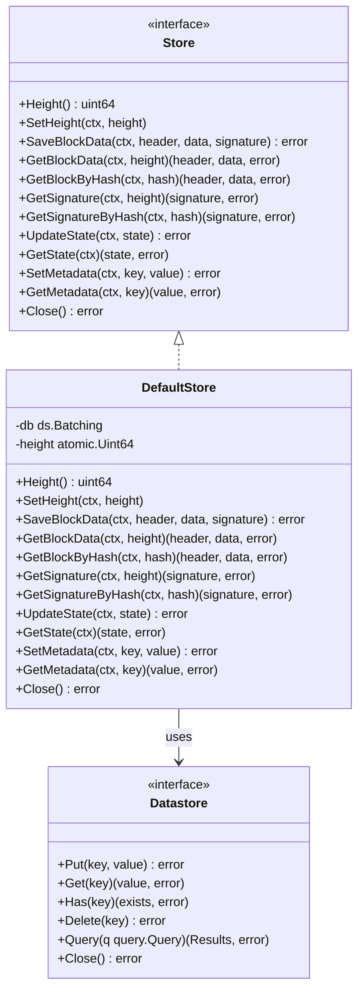
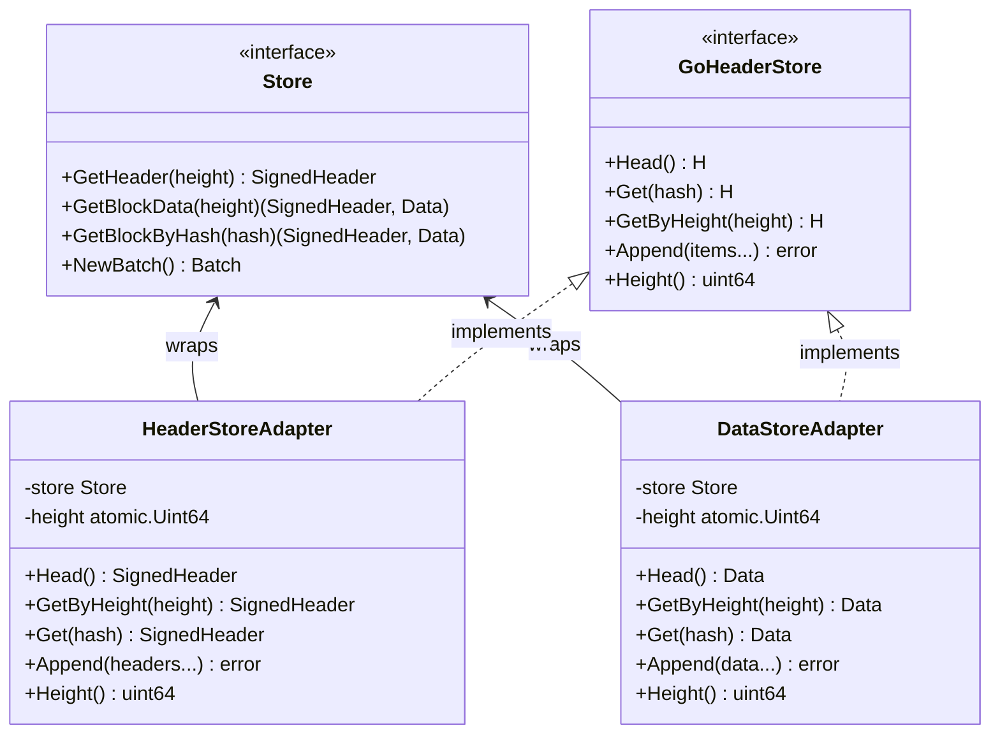

# Evolve Storage System

The `store` package provides a persistent storage solution for Evolve, designed to efficiently store and retrieve blockchain data such as blocks, signatures, state, and metadata.

## Overview

The storage system consists of a key-value store interface that allows for the persistence of blockchain data. It leverages the IPFS Datastore interface (`go-datastore`) with a Badger database implementation by default.

Badger options are tuned for the ev-node write pattern (append-heavy with periodic overwrites) via `store.BadgerOptions()`. Use `tools/db-bench` to validate performance against Badger defaults.

## Core Components

### Storage Interface

The main interface (`Store`) defines methods for:

- Block data storage and retrieval
- State management
- Metadata storage
- Height tracking and querying

### Implementation

The `DefaultStore` is the standard implementation of the `Store` interface, utilizing a key-value datastore.

## Data Organization

The store organizes data using a prefix-based key system:

| Prefix | Purpose                      | Key Format    |
| ------ | ---------------------------- | ------------- |
| `h`    | Block headers                | `/h/{height}` |
| `d`    | Block data                   | `/d/{height}` |
| `i`    | Block index (hash -> height) | `/i/{hash}`   |
| `c`    | Block signatures             | `/c/{height}` |
| `s`    | Chain state                  | `s`           |
| `m`    | Metadata                     | `/m/{key}`    |

## Block Storage Sequence

```mermaid
sequenceDiagram
    participant App as Application
    participant Store as DefaultStore
    participant DS as Datastore

    App->>Store: SaveBlockData(header, data, signature)
    Store->>Store: Prepare batch
    Store->>DS: Put header
    Store->>DS: Put data
    Store->>DS: Put signature
    Store->>DS: Put block hash → height index
    Store->>DS: Commit batch

    App->>Store: GetBlockData(height)
    Store->>DS: Get header
    DS->>Store: Return header blob
    Store->>Store: Unmarshal header
    Store->>DS: Get data
    DS->>Store: Return data blob
    Store->>Store: Unmarshal data
    Store->>App: Return header, data
```



## Store Component Architecture



## Usage Examples

### Creating a Store

```go
// In-memory store (for testing)
kvStore, err := store.NewTestInMemoryKVStore()
if err != nil {
    // handle error
}
myStore := store.New(kvStore)

// Persistent store
kvStore, err := store.NewDefaultKVStore("/path/to/root", "data", "ev-db")
if err != nil {
    // handle error
}
myStore := store.New(kvStore)
```

### Saving and Retrieving Data

```go
// Save block data
err := myStore.SaveBlockData(ctx, header, data, signature)

// Get block by height
header, data, err := myStore.GetBlockData(ctx, height)

// Get block by hash
header, data, err := myStore.GetBlockByHash(ctx, blockHash)

// Update state
err := myStore.UpdateState(ctx, newState)

// Get current state
state, err := myStore.GetState(ctx)

// Store metadata
err := myStore.SetMetadata(ctx, "myKey", []byte("myValue"))

// Retrieve metadata
value, err := myStore.GetMetadata(ctx, "myKey")
```

## Advanced Usage: Batching Operations

For performance-critical operations, the underlying datastore supports batching:

```go
batch, err := kvStore.Batch(ctx)
if err != nil {
    // handle error
}

// Add operations to batch
batch.Put(ctx, key1, value1)
batch.Put(ctx, key2, value2)
batch.Delete(ctx, key3)

// Commit all operations atomically
err = batch.Commit(ctx)
```

## Store Adapters for P2P Integration

The store package provides adapter implementations that wrap the ev-node store to satisfy the `header.Store[H]` interface from the `go-header` library. This enables the ev-node store to be used directly by go-header's P2P infrastructure, eliminating data duplication.

### Background

Previously, ev-node maintained redundant storage:

1. **ev-node store** - Primary store for headers, data, state, and metadata
2. **go-header stores** - Separate stores for P2P sync (headerSync and dataSync prefixes)

This resulted in the same headers and data being stored multiple times.

### Solution: Store Adapters

Two adapter types wrap the ev-node store:

- **`HeaderStoreAdapter`** - Implements `header.Store[*types.SignedHeader]`
- **`DataStoreAdapter`** - Implements `header.Store[*types.Data]`

These adapters:

- Read from the single ev-node store
- Write to the ev-node store when receiving data via P2P
- Provide the interface required by go-header's exchange server, syncer, and subscriber

### Usage

```go
// Create the ev-node store
evStore := store.New(kvStore)

// Create adapters for P2P infrastructure
headerAdapter := store.NewHeaderStoreAdapter(evStore)
dataAdapter := store.NewDataStoreAdapter(evStore)

// Use with go-header P2P components
exchangeServer, _ := goheaderp2p.NewExchangeServer(host, headerAdapter, opts...)
```

### Benefits

1. **Single source of truth** - All block data lives in one place
2. **Reduced disk usage** - No duplicate storage of headers and data
3. **Simplified rollback** - Rolling back the ev-node store automatically affects P2P sync
4. **Atomic operations** - Block storage and state updates remain atomic

### Architecture


