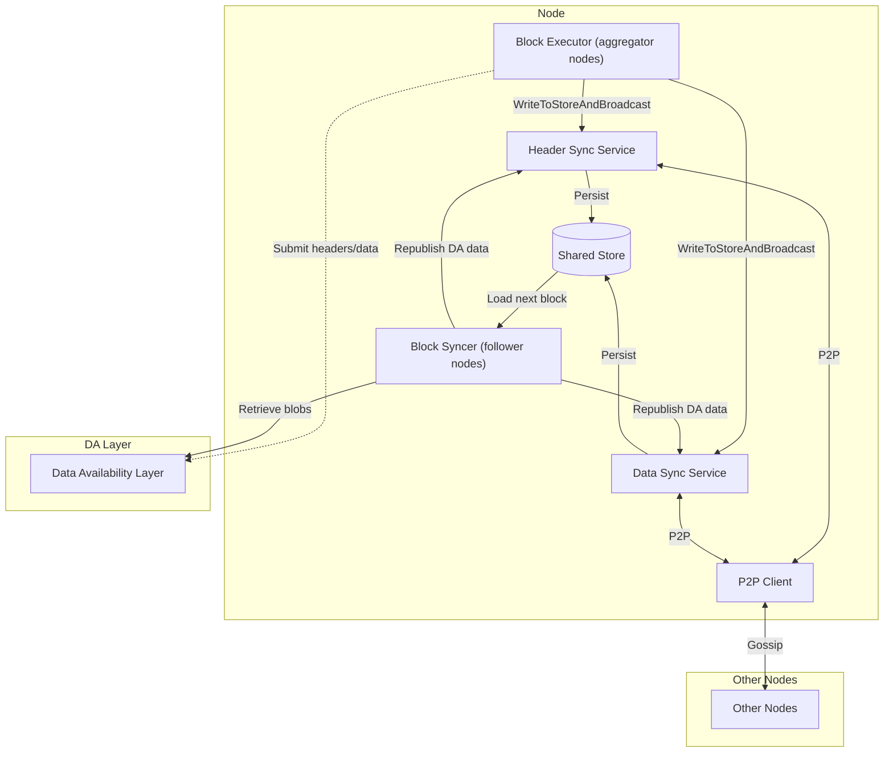
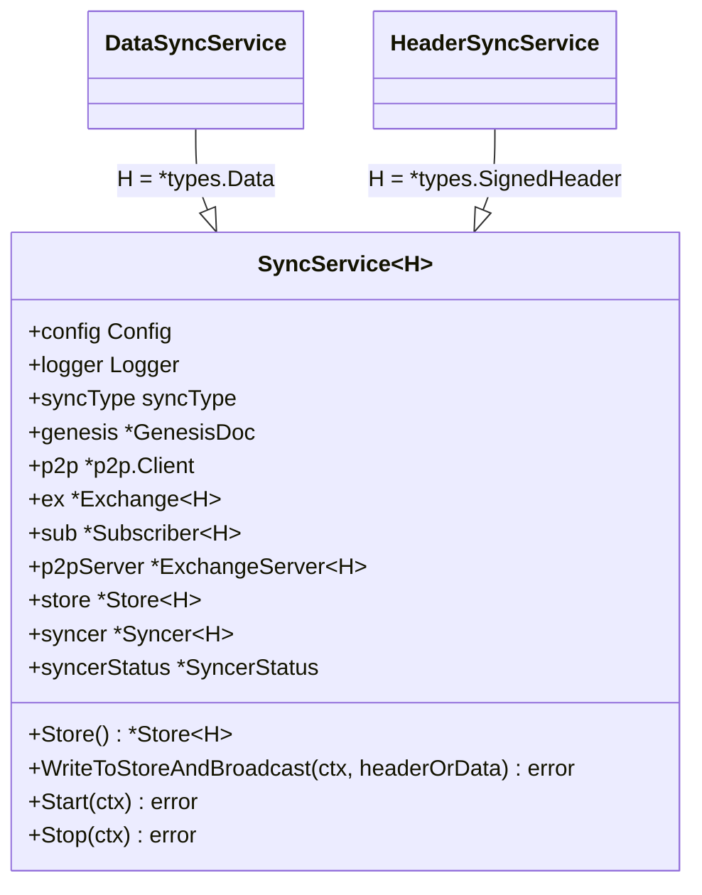
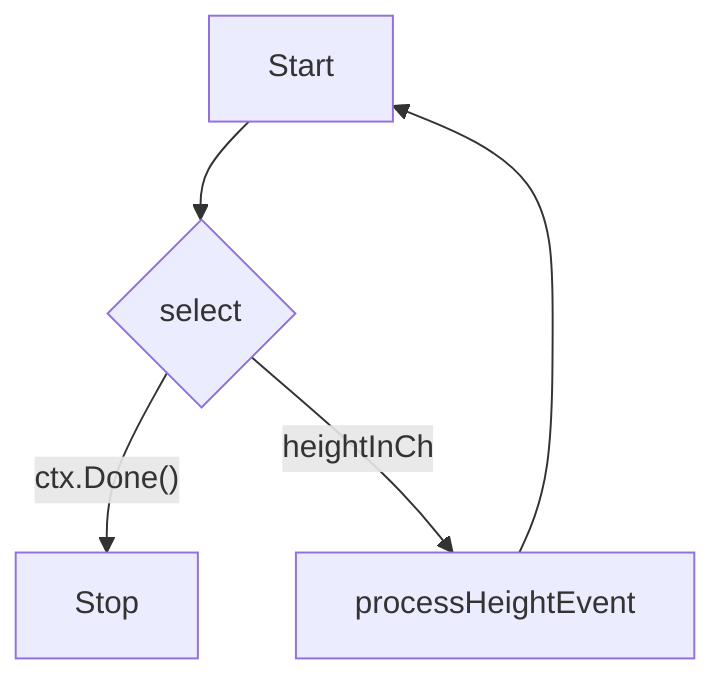

# Evolve Sync Service

This document explains how the Evolve Sync Service works, its dependencies, and its architecture.

## Overview

Evolve's Sync Service is responsible for synchronizing block headers and data across nodes in the Evolve network. It's a critical component that allows nodes to maintain a consistent view of the blockchain state.

The sync mechanism consists of two main components:

1. **Header Sync Service** - responsible for synchronizing block headers
2. **Data Sync Service** - responsible for synchronizing block data (transactions and metadata)

Both services are instances of the same generic `SyncService` and differ only by the header type they specialize (signed headers vs. block data).

## Architecture



## Key Components

### 1. SyncService (`pkg/sync/sync_service.go`)

A generic service that implements both header and data synchronization using type parameters:



#### Lifecycle and responsibilities

- `node/full.go` wires the header and data services into both aggregator and follower nodes (see `initHeaderSyncService` and `initDataSyncService`).
- Both services wrap a go-header `Store` instance that is prefixed per sync type, allowing them to share disk state while keeping namespaces separate.
- `WriteToStoreAndBroadcast` (also used by the block executor) ensures the store is initialized with genesis data, starts the go-header syncer once via `SyncerStatus`, and gossips new items through libp2p.
- When the node runs in follower mode, the go-header syncer fills the store from peers; when running as an aggregator, locally produced blocks flow through the same method.

### 2. Block Syncer (`block/internal/syncing/syncer.go`)

Follower nodes construct the block syncer to hydrate local state from the shared go-header stores and the DA layer. The syncer owns two long-lived goroutines that coordinate incoming events and outbound fetches.

#### a. `processLoop`

- Listens on `heightInCh` for new `DAHeightEvent` values sourced from P2P or DA.
- Uses the in-memory cache to de-duplicate and park out-of-order heights.
- Calls `trySyncNextBlock` to execute the next block when header and data are available.



#### b. Worker loops

- `daWorker` – waits for genesis, then continually invokes `tryFetchFromDA`, respecting backoff windows and bumping the tracked DA height as blobs arrive.
- `p2pWorker` – polls the go-header stores, and when they advance past the local height, hands the range to `ProcessHeaderRange` / `ProcessDataRange` so watcher goroutines can block on the next missing height.
- `pendingWorker` – periodically drains cached events via `processPendingEvents`, ensuring gaps filled from disk or DA are replayed promptly.
- All three workers honor `ctx.Done()` and share the syncer’s wait group, so shutting down the syncer or test harness simply cancels the context and waits for the loops to exit.

#### c. Supporting helpers

- `processPendingEvents` replays cached events once the next height becomes available.
- `trySyncNextBlock` validates, executes, and persists the block via the execution client and shared store.
  - Persists the block through a `store.Store` batch, bumps height/state, and marks headers/data as seen to enforce sequential progress and metrics updates.
- `tryFetchFromDA` manages DA backoff windows and advances `daHeight` on success.
- `tryFetchFromP2P` reads the latest height from both header and data go-header stores, enqueueing any ranges the node has not yet processed.

## Communication Paths

The block syncer relies on a handful of queues and shared stores to keep the node in sync:

1. `heightInCh` – Buffered queue that carries `common.DAHeightEvent` values from both the P2P handler and DA retriever into `processLoop`.
2. `cache.Manager` – In-memory structure that tracks pending events and deduplicates headers/data that arrive out of order.
3. `headerStore` / `dataStore` – go-header stores exposed by the sync services. Aggregators append to them when producing blocks; followers poll them in `tryFetchFromP2P` to learn about new ranges.
4. `errorCh` – Channel surfaced to the higher-level block components so critical execution failures inside the syncer can halt the node cleanly.

## Synchronization Process

1. Aggregator executors call `WriteToStoreAndBroadcast`, or remote peers gossip new headers and block data through the sync services.
2. `SyncService` instances persist the payload in the prefixed go-header stores and broadcast it over libp2p.
3. Follower syncers observe the updated store heights, fetch any missing data via P2P or the DA layer, and enqueue events on `heightInCh`.
4. The syncer executes the block via the execution client, writes it to `store.Store` using a batch, updates in-memory state, and records metrics.
5. For DA-sourced events, the syncer republishes the block by calling `WriteToStoreAndBroadcast` on the header and data services (`block/internal/syncing/syncer.go:389-392`) so gossip peers stay updated.
6. Successfully applied blocks are now visible to both the local node and the sync services, keeping aggregator and follower paths in sync.
7. Aggregator nodes additionally submit headers/data to the DA layer for finality.

## Integration with Block Components

The sync package is consumed by both the block executor (aggregator mode) and the block syncer (follower mode):

- **Aggregator nodes** – `node/full.go:101` constructs `block.NewAggregatorComponents`, which in turn creates `block/internal/executing.Executor`. After the executor commits a block, it calls `WriteToStoreAndBroadcast` on the header and data services (`block/internal/executing/executor.go:415`). This persists the block in the shared store and gossips it to peers.
- **Follower nodes** – `node/full.go:116` builds `block.NewSyncComponents`, wiring the same sync services into `block/internal/syncing.Syncer`. The syncer consumes updates written by the services (`block/internal/syncing/syncer.go:77`) and merges them with DA retrieval to hydrate local state.
- **Common broadcaster contract** – Both block paths depend only on the slim `block/internal/common.Broadcaster` interface, so alternate sync implementations can be plugged in as long as they expose `WriteToStoreAndBroadcast` and `Store`.
- **Execution engine boundary** – Because the sync services operate on generic header types, swapping execution engines only requires satisfying the `core/execution.Executor` interface; the sync plumbing remains unchanged.

## Dependencies

- `github.com/ipfs/go-datastore` - Core datastore interface
- `github.com/ipfs/go-datastore/sync` - Thread-safe datastore wrapper
- `github.com/celestiaorg/go-header` - Header synchronization library
- `github.com/libp2p/go-libp2p` - P2P networking stack
- `github.com/evstack/ev-node/pkg/da/types` - Data Availability interface and types

## Data Flow

```mermaid
sequenceDiagram
    participant P as Proposer Node
    participant DA as Data Availability Layer
    participant FN as Full Node

    P->>P: Create Block
    P->>DA: Submit Header to DA
    P->>FN: Broadcast Header (P2P)
    P->>FN: Broadcast Data (P2P)

    FN->>FN: Receive Header via P2P
    FN->>FN: Store Header
    FN->>FN: Receive Data via P2P
    FN->>FN: Store Data

    FN->>FN: Validate and Apply Block

    alt Header missing
        FN->>DA: Retrieve Header
    end

    alt Data missing
        FN->>P: Request Data via P2P
    end
